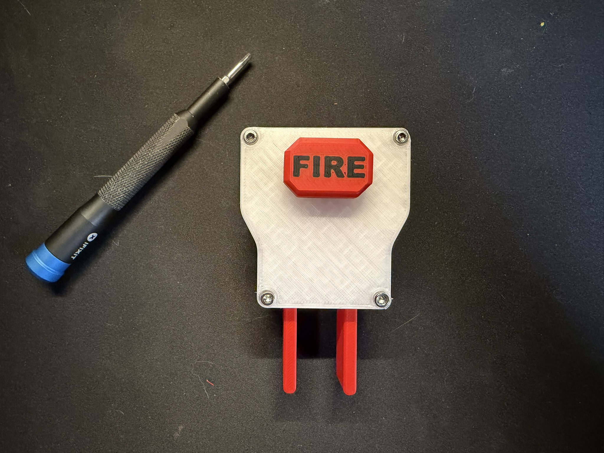
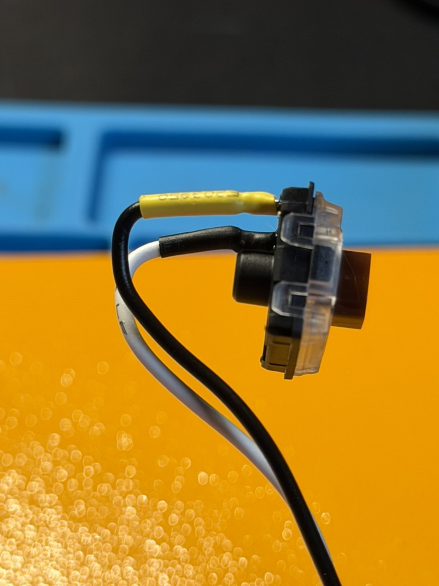
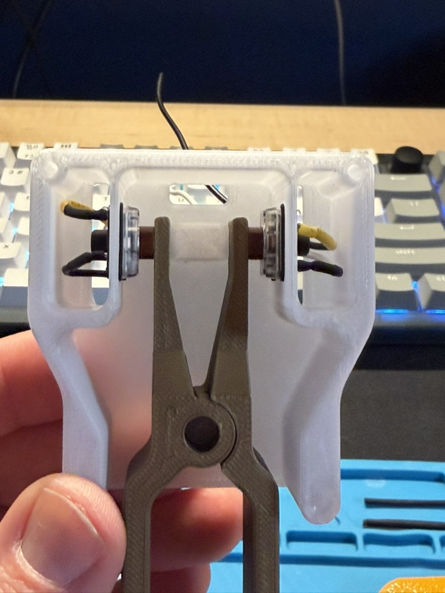
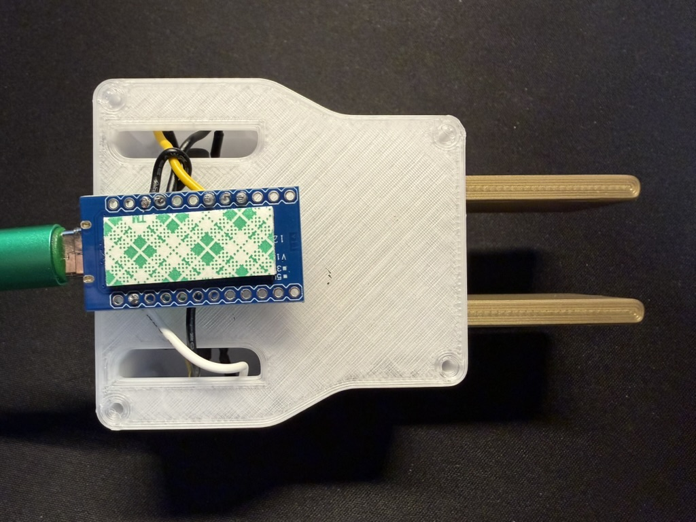

# MORSE Keyer

A DIY iambic paddle keyer for the [MORSE game](https://morse.withgoogle.com/learn/), built with a Pro Micro and QMK firmware.



## Features

- Iambic paddle input
- Fire button for sending characters
- Plug-and-play USB HID keyboard (no drivers needed)
- Works on Windows, Mac, and Linux

## Bill of Materials

| Component | Quantity | Notes |
|-----------|----------|-------|
| Pro Micro (ATmega32U4) | 1 | 5V/16MHz version |
| Low-profile keyboard switches | 3 | For dot, dash, and fire |
| Enclosure | 1 | 3D printed (see below) |
| USB data cable | 1 | For connection to computer |

## Wiring

| Switch | Pin | Function |
|--------|-----|----------|
| Left paddle | D4 | Dot (sends Ctrl) |
| Right paddle | C6 | Dash (sends Space) |
| Fire button | D7 | Fire (sends Enter) |

Each switch connects between the pin and GND.

_Note that if you want to key with your left hand, you might want to swap the wiring of the left and right paddles._

## 3D Printed Enclosure and Paddles

All files can be found in [cad_files](cad_files). You are welcome to make any modifications that you like to my design (including making it easier to wire).

Print one of each 3MF file:

- Base
- Case
- Lid
- Paddles
- Fire Button

### Notes on printing

The base and lid both use bridging over the screw holes to avoid needing supports. Just use a screwdriver to poke through.

The paddles print together to avoid any support material. There is a 3rd body within the 3MF that you can mark as a modifier in your slicer. Set it to ironing to prevent the two parts from sticking together. It will probably work without this, but it seemed like a cool idea.

The FIRE letters are separate bodies in the button file. You can mark them as negatives in your slicer for an inset style or you can use them for easy multicolor printing.


## Assembly Guide

The hardest part is soldering wires to the keyswitch pins. Also cut your wires long to start. You can trim them later after routing everything.

1. Solder a wire to each pin of the keyswitches. You can color-code them, but since we aren't using diodes, it does not matter which wire goes to GND and which goes to a signal pin on the Pro Micro.

*I would highly advise adding some heat shrink for strain relief. The keyboard pins are very fragile.*

2. Prebend the wires as shown above, then snap them into each of the three holes. For the paddle switches, orient the wires on top for extra strain relief. For the FIRE switch, have the pins closest to the back edge of the lid.


3. After inserting all of the switches and routing the cables, you can insert the paddles and affix the lid with four M3 screws.

4. Put some doublesided tape on the underside of the Pro Micro.

5. Trim your wires and solder them to the Pro Micro as laid out above. There are exactly three ground pins, so you don't need to double anything up. **Note that the tape is facing the bottom.**


6. **Before closing everything up, you need to flash the firmware onto your Arduino Pro Micro. See the [Firmware](#firmware) section below.**

7. Now smush it all down, remove film on your tape, and try to stuff it into the base. It won't be particularly pretty, but if you kept your wires short-ish, everything should seal up.

8. Plug it in and start playing!

## Firmware

The keyer uses [QMK Firmware](https://qmk.fm/) to act as a USB keyboard.

### Option 1: Flash Pre-compiled Firmware (Recommended)

Download the latest `morse_keyer_default.hex` from the [Releases](../../releases) page.

#### Windows / Mac

1. Download and install [QMK Toolbox](https://github.com/qmk/qmk_toolbox/releases)
2. Open QMK Toolbox
3. Select the `.hex` file you downloaded
4. Set MCU to `atmega32u4`
5. Connect your Pro Micro and short the RST pin to GND twice quickly (within 1 second) to enter bootloader mode. I use some fine-tipped tweezers for this.
6. Click "Flash"

#### Linux
Let's be honest, you're used to this crap.

Install `avrdude` using your distro package manager (you may also need to add your user to the `dialout` group for serial port access) and run:

```bash
# Enter bootloader mode first (short RST to GND twice quickly)
avrdude -p atmega32u4 -c avr109 -P /dev/ttyACM0 -U flash:w:morse_keyer_default.hex:i
```

> **Note:** The port may vary. Check `dmesg` after connecting to find the correct device.

### Option 2: Build from Source

If you want to customize the firmware:

1. [Set up QMK](https://docs.qmk.fm/#/newbs_getting_started)
2. Copy the `firmware` folder to your QMK keyboards directory:
   ```bash
   cp -r firmware ~/qmk_firmware/keyboards/morse_keyer
   ```
3. Compile and flash:
   ```bash
   qmk flash -kb morse_keyer -km default
   ```

### Entering Bootloader Mode

The Pro Micro uses the Caterina bootloader. To enter bootloader mode:

1. Connect the Pro Micro via USB
2. Short the RST pin to GND **twice quickly** (within ~1 second)
3. The bootloader will be active for about 8 seconds
4. Flash immediately when the device appears

> **Tip:** If you're having trouble, try shorting RST to GND once, wait a second, then short again.

### Customizing the Keymap

Edit `firmware/keymaps/default/keymap.c` to change the key assignments:

```c
const uint16_t PROGMEM keymaps[][MATRIX_ROWS][MATRIX_COLS] = {
    [0] = LAYOUT(
        KC_LCTL,  // Dot (left paddle)
        KC_SPC,   // Dash (right paddle)
        KC_ENT    // Fire
    )
};
```

See the [QMK Keycodes documentation](https://docs.qmk.fm/#/keycodes) for available key options.

---

## License

MIT License
